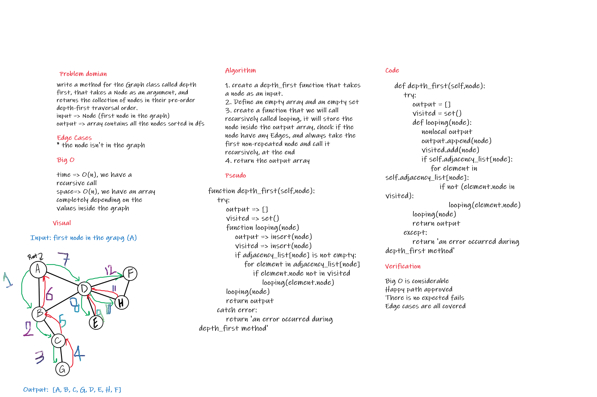

## Code

[Code](graph/graph.py)

# Challenge Summary

write a method for the Graph class called depth first, that takes a Node as an argument, and returns the collection of nodes in their pre-order depth-first traversal order.

## Whiteboard Process



## Approach & Efficiency

the approach used is creating an empty array and an empty set, then create a function that we will call recursively called looping, it will store the node inside the output array, check if the node have any Edges, and always take the first non-repeated node and call it recursively, at the end, we return the output array.

time complexity: it's O(n), we have a recursive call

space complexity: it's O(n), we have an array completely depending on the values inside the graph

## Solution

the solution starts with creating an empty array to store the nodes one by one in a pre-ordered way, then a recursive call is applied to 

```
    def depth_first(self,node):
        try:
            output = []
            visited = set()
            def looping(node):
                nonlocal output
                output.append(node)
                visited.add(node)
                if self.adjacency_list[node]:
                    for element in self.adjacency_list[node]:
                        if not (element.node in visited):
                            looping(element.node)
            looping(node)
            return output
        except:
            return 'an error occurred during depth_first method'
```