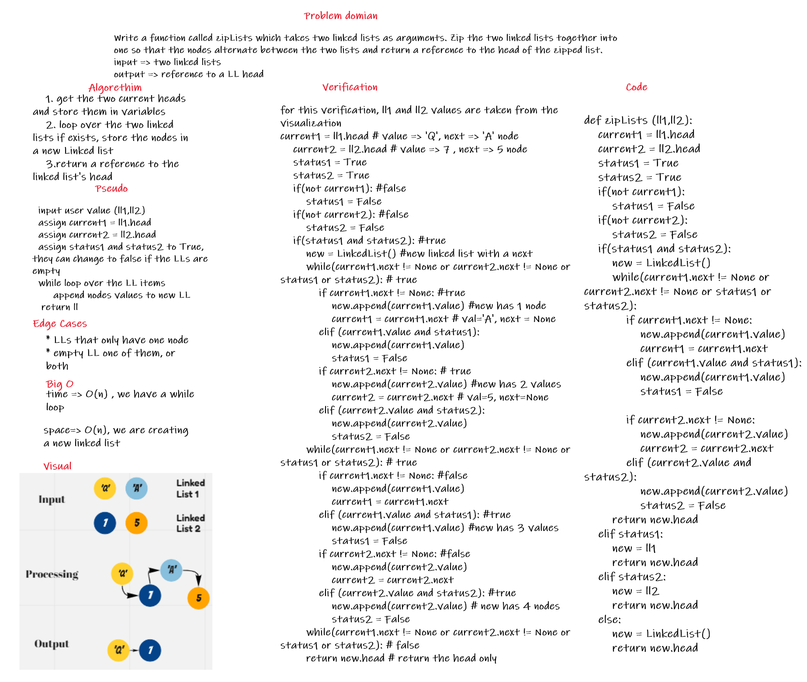

## Code Link

[code Link](ll_zip/ll_zip.py)

## Whiteboard Process

# Linked list

Like arrays, Linked List is a linear data structure. Unlike arrays, linked list elements are not stored at a contiguous location; the elements are linked using pointers.

## Why Linked List

* The size of the arrays is fixed: So we must know the upper limit on the number of elements in advance. Also, generally, the allocated memory is equal to the upper limit irrespective of the usage. 

* Inserting a new element in an array of elements is expensive because the room has to be created for the new elements and to create room existing elements have to be shifted. 

[//]: # (reference from geeksforgeeks.org)

## Build

we have seven methods and a function for now, insert, append, include, str, insertBefore, insertAfter, kthFromEnd and zipLists. the insert method is for when the user wants to insert a value at the beginning of the Linked list, the append is for if the user wants to insert a value at the end of the Linked list, the str prints a string containing all the elements inside the linked list in an organized matter, and the include checks if the value is in the linked list or not, insertBefore is to insert a new node before a certain existing node the insertAfter to insert a new node after a certain existing node, kthFromEnd is to check the nodes values from the end, and zipLists function is for combining two linked lists together.

## Testing

for the testing part, i tried to cover as much possibilities as possible, the tests were in this order:

1. testing Node: testing the Node class if it's working properly by sending one value and checking the value and the next of that object

2. testing append by itself: by conducting a test that utilizes any possible error, including having a single or multiple Nodes inside the Linked list

3. testing append and insert at the same time: with testing all the possible situations, including starting with insert only, having insert between appends

4. testing the include method: first for an empty linked list, then for one that only has one element, at last, for one that has multiple Nodes

5. testing the str method: which should return a string of the values in the Linked list, edge case is for an empty Linked list

6. testing the insertAfter method: to check how the method react for empty Linked lists, ones that are normal and ones that don't have the value

7. testing the insertBefore: to check how the method react for empty Linked lists, ones that are normal, and ones that don't have the value

8. testing the kthFromEnd: to check how the method react for empty Linked lists, ones that are normal, and ones that don't have the value

9. testing zipLists function: test against one empty LL, two empty LL, LL that only have one node, LLs that differ in length, to make sure to cover all situations

## Big O, time complexity

1. append: Big O is O(n), because we have to loop over the entire linked list in order to append a value

2. insert: Big O is O(1), we only need to redefine the head and the next for the head

3. includes : Big o is O(n) for now, but it's going to be O(1) in the future 

4. str: Big O is O(n), we are looping over the linked list

5. insertAfter : it's Big O(n), we are looping over the instance

6. insertBefore : it's Big O(n), we are looping over the instance

7. kthFromEnd :  it's Big O(n), we are looping over the entire instance

8. zipLists : it's Big O(n) at it's worst scenario, that is looping over an entire linked lists

# API

this project has several functionalities, including:

1. insert method is for when the user wants to insert a value at the beginning of the Linked list.

2. the append is for if the user wants to insert a value at the end of the Linked list.

3. the str method prints a string containing all the elements inside the linked list in an organized matter.

4. include method checks if the value is in the linked list or not

5. insertAfter method to insert a value after a certain node, if exists

6. insertBefore method to insert a value before a certain node, if exists

7. kthFromEnd method is to look up for a node value, starting from the end

8. zipLists is to compile two linked lists into one