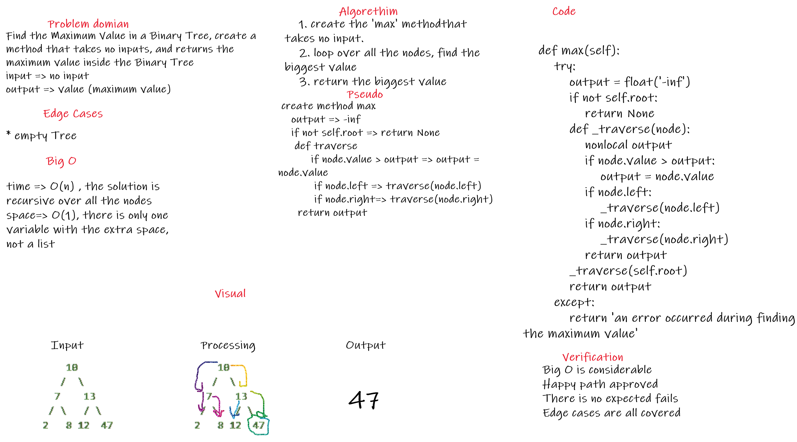

## Code link

[Code](trees/trees.py)

# Challenge Summary
Find the Maximum Value in a Binary Tree, create a method that takes no inputs, and returns the maximum value inside the Binary Tree

## Whiteboard Process



## Approach & Efficiency

the approach used in this challenge is looping over all the elements inside the binary tree, because it's not sorted as the binary search tree, saving the maximum value then return it. all the edge cases are covered properly, that will be discussed inside the Solution

## Solution

for the solution, this code loops over all the nodes using the regression logic, checks every value inside the Tree if it's bigger or smaller than the temporary one, then return the largest one, in case of an empty tree, the return is None, the following is the code

```
    def max(self):
        try:
            output = float('-inf')
            if not self.root:
                return None
            def _traverse(node):
                nonlocal output
                if node.value > output:
                    output = node.value
                if node.left:
                    _traverse(node.left)
                if node.right:
                    _traverse(node.right)
                return output
            _traverse(self.root)
            return output
        except:
            return 'an error occurred during finding the maximum value'
```