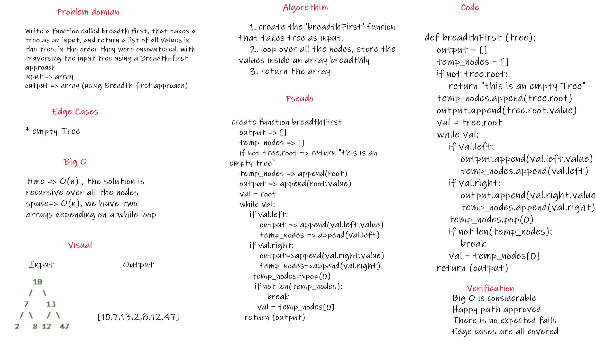

## Code link

[Code](breadthfirst/breadth_first.py)

# Challenge Summary
Write a function called breadth first, which iterates through the tree by going through each level of the tree node-by-node. So, given our starting tree one more time.

## Whiteboard Process


## Approach & Efficiency

Breadth first traversal iterates through the tree by going through each level of the tree node-by-node. So, given our starting tree one more time
the approach used is creating an empty array to return, and one for the nodes, in order to loop over them level by level, the big O for such a solution is:

for the time complexity => O(n)
for the space complexity => O(n)

## Solution

for the solution, i followed the instruction shown by the images step by step, and came up with this solution, it loops over every level of the tree from left to right, then goes to the next level, the following is the solution:

```
def breadthFirst (tree):    
    output = []
    temp_nodes = []
    if not tree.root:
        return "this is an empty Tree"
    temp_nodes.append(tree.root)
    output.append(tree.root.value)
    val = tree.root
    while val:
        if val.left:
            output.append(val.left.value)
            temp_nodes.append(val.left)
        if val.right:
            output.append(val.right.value)
            temp_nodes.append(val.right)
        temp_nodes.pop(0)
        if not len(temp_nodes):
            break
        val = temp_nodes[0]
    return (output)
```