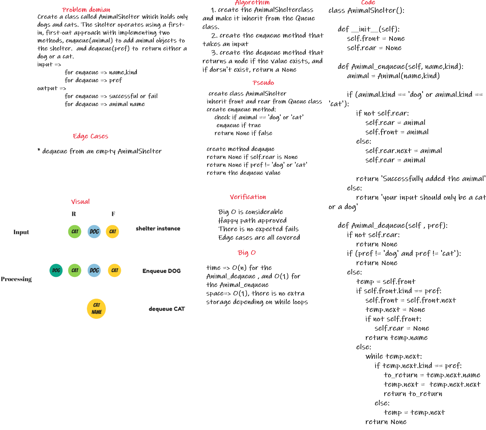

## code link

[code Link](fifo_animal_shelter/fifo_animal_shelter.py)

# Challenge Summary
Create a class called AnimalShelter which holds only dogs and cats. The shelter operates using a first-in, first-out approach. implement these methods:

* enqueue(animal): adds animal to the shelter. animal can be either a dog or a cat object.

* dequeue(pref): returns either a dog or a cat. If pref is not "dog" or "cat" then return null.

## Whiteboard Process


## Approach & Efficiency

i created the AnimalShelter class, and another class called Animal that creates animals instances, then utilized the front and the rear method, with thinking about all the edge cases possible, i created a suitable code for enqueue and dequeue methods

## Solution

for the enqueue method, i used this simple code that checks if the input is 'cat' or 'dog' or anything else, then add it to the Queue instance
```
    def Animal_enqueue(self, name,kind):
        animal = Animal(name,kind)

        if (animal.kind == 'dog' or animal.kind == 'cat'):
            if not self.rear:
                self.rear = animal
                self.front = animal
            else:
                self.rear.next = animal
                self.rear = animal

            return 'Successfully added the animal'
        else:
            return 'your input should only be a cat or a dog'
```

then i used a code for the dequeue method, first i checked if the Queue is empty or not, then checked if the prep is 'dog' or 'cat' or something else, then i dequeue the value if exists

```
    def Animal_dequeue(self , pref):
        if not self.rear:
            return None
        if (pref != 'dog' and pref != 'cat'):
            return None
        else:
            temp = self.front
            if self.front.kind == pref:
                self.front = self.front.next
                temp.next = None
                if not self.front:
                    self.rear = None
                return temp.name
            else:
                while temp.next:
                    if temp.next.kind == pref:
                        to_return = temp.next.name
                        temp.next =  temp.next.next
                        return to_return
                    else:
                        temp = temp.next
                return None
```
