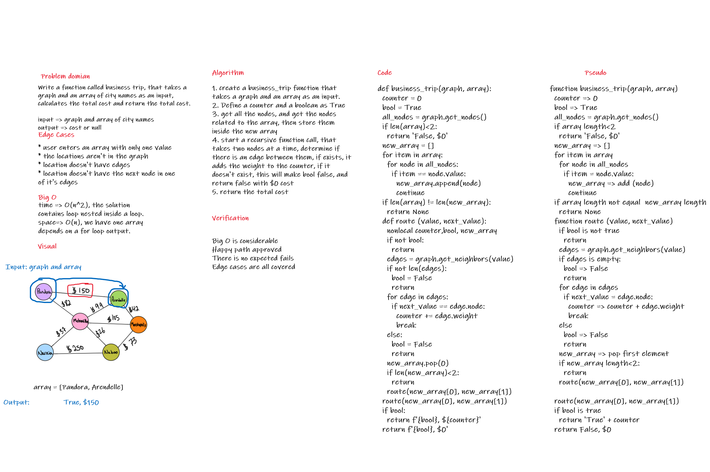

## Code

[code](graph_business_trip/graph_business_trip.py)


# Challenge Summary
Write a function called business trip, that takes a graph and an array of city names as an input, calculates the total cost and return the total cost if the trip can be done, or a none if it's not possible

## Whiteboard Process



## Approach & Efficiency

the approach used assures that there is no edge case that can happen at all

* Define a counter and a boolean as True, the moment the boolean turns into false, this means that the trip can't be made.

* get all the nodes, and get the nodes related to the array, then store them inside the new array

* start a recursive function call, that takes two nodes at a time, determine if there is an edge between them, if exists, it adds the weight to the counter, if it doesn't exist, this will make bool false, and return false with $0 cost

* return the total cost

time complexity => O(n^2), the solution contains loop nested inside a loop.

space complexity => O(n), we have one array depends on a for loop output.

## Solution

the solution by determining the destinations, then check for the Edge's weight if exists, and at last, return the cost if the trip can be made, or return a 0 and False if it can't be made.

```
def business_trip(graph, array):
  counter = 0
  bool = True
  all_nodes = graph.get_nodes()
  # first, we check if the array have more than one value
  if len(array)<2:
    return 'False, $0'
  # then , we check if the given values are inside the graph nodes
  new_array = []
  for item in array:
    for node in all_nodes:
      if item == node.value:
        new_array.append(node)
        continue
  if len(array) != len(new_array):
    return None

  # now, we check the value step by step
  def route (value, next_value):
    nonlocal counter,bool, new_array, graph
    if not bool:
      return

    edges = graph.get_neighbors(value)
    if not len(edges):
      bool = False
      return
    for edge in edges:
      if next_value == edge.node:
        counter += edge.weight
        break
    else:
      bool = False
      return
    new_array.pop(0)
    if len(new_array)<2:
      return
    route(new_array[0], new_array[1])

  route(new_array[0], new_array[1])
  if bool:
    return f'{bool}, ${counter}'

  return f'{bool}, $0'
```