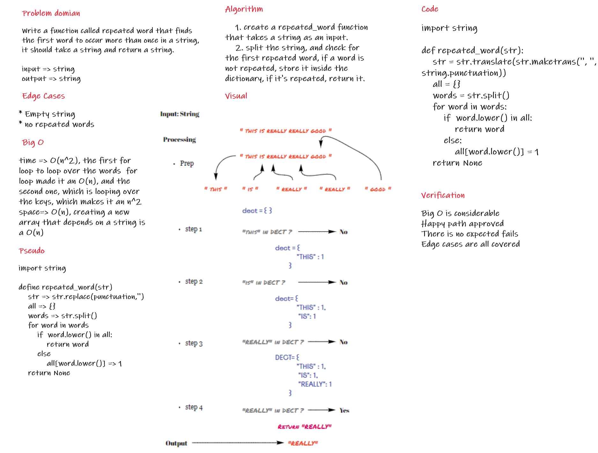

## Code Link

[Code](hashmap_repeated_words/hashmap.py)

# Challenge Summary

Write a function called repeated word that finds the first word to occur more than once in a string, it should take a string and return a string.

## Whiteboard Process



## Approach & Efficiency

the approach taken is first removing all the punctuation from the string, splitting the string, then store the string inside a dictionary as a key if it's not a key, and if it's a key, the word will be returned as the first duplicated word.

the time complexity is O(n^2), for the time complexity, the first for loop to loop over the words  for loop made it an O(n), and the second one, which is looping over the keys, which makes it an n^2, and for the space complexity, creating a new array that depends on a string is a O(n)

## Solution

for the solution, i made sure that there will be no way an edge case is not taken care of, the following block of code is the complete solution

```
import string

def repeated_word(str):
    str = str.translate(str.maketrans('', '', string.punctuation))
    all = {}
    words = str.split()
    for word in words:
        if  word.lower() in all:
            return word
        else:
            all[word.lower()] = 1
    return None
```