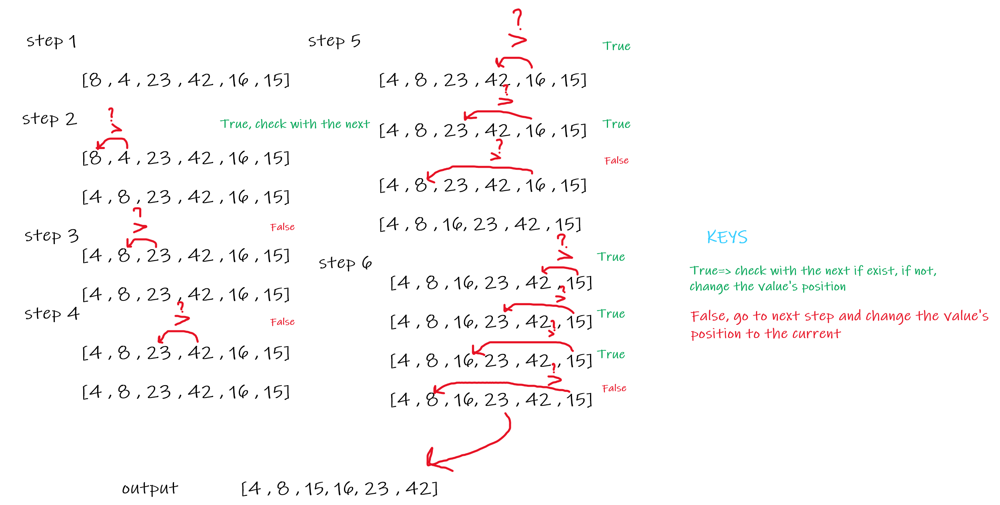

# Insertion sort

Insertion sort is a simple sorting algorithm that works similar to the way you sort playing cards in your hands. The array is virtually split into a sorted and an unsorted part. Values from the unsorted part are picked and placed at the correct position in the sorted part.

## Tracing the code

Sample Array: [8,4,23,42,16,15]

## Efficiency

> Space: O(1)

No additional space is being created. This array is being sorted in place…keeping the space at constant O(1).

> Time: O(n^2)

We have two nested loops depending on each other