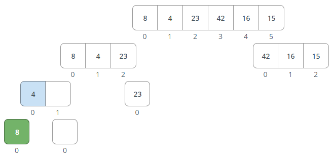
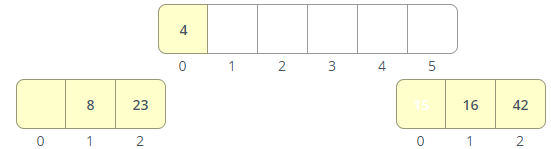
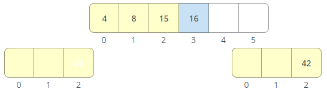
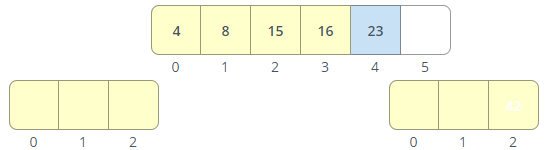
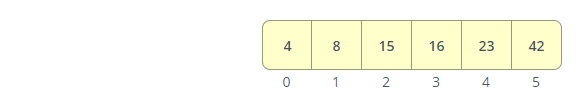

# Merge Sort

Merge sort is one of the most efficient sorting algorithms. It works on the principle of Divide and Conquer. Merge sort repeatedly breaks down a list into several sub-lists until each sub-list consists of a single element and merging those sub-lists in a manner that results into a sorted list.

## Tracing

Step 1:
Select the entire array

 

Step 2:
Split the selected array (as evenly as possible)

 

Step 3:
Select the left sub-array

 

Step 4:
Split the selected array (as evenly as possible)
 

Step 5:
Select the left sub-array
 

Step 6:
Split the selected array (as evenly as possible)
 

Step 7:
An array of length 1 cannot be split, ready for merge
 

Step 8:
An array of length 1 cannot be split, ready for merge
 

Step 9:
Merge selected arrays back together, in sorted order
 

Step 10:
Select the minimum of the two values
 

Step 11:
Add the selected value to the sorted array
 

Step 12:
When one list becomes empty, copy all values from the remaining array into the sorted array
 

Step 13:
Add the selected value to the sorted array
 

Step 14:
Finished merging
 

Step 15:
An array of length 1 cannot be split, ready for merge
 

Step 16:
Merge selected arrays back together, in sorted order
 

Step 17:
Select the smallest value from the front of each list (excluding values already in the sorted array)
 

Step 18:
Select the minimum of the two values
 

Step 19:
Add the selected value to the sorted array
 

Step 20:
Select the smallest value from the front of each list (excluding values already in the sorted array)
 

Step 21:
Select the minimum of the two values
 

Step 22:
Add the selected value to the sorted array
 

Step 23:
When one list becomes empty, copy all values from the remaining array into the sorted array
 

Step 24:
Add the selected value to the sorted array
 

Step 25:
Finished merging
 

Step 26:
Select the right sub-array
 

Step 27:
Split the selected array (as evenly as possible)
 

Step 28:
Select the left sub-array
 

Step 29:
Split the selected array (as evenly as possible)
 

Step 30:
An array of length 1 cannot be split, ready for merge
 

Step 31:
An array of length 1 cannot be split, ready for merge
 

Step 32:
Merge selected arrays back together, in sorted order
 

Step 33:
Select the minimum of the two values
 

Step 34:
Add the selected value to the sorted array
 

Step 35:
When one list becomes empty, copy all values from the remaining array into the sorted array
 

Step 36:
Add the selected value to the sorted array
 

Step 37:
Finished merging
 

Step 38:
An array of length 1 cannot be split, ready for merge
 

Step 39:
Merge selected arrays back together, in sorted order
 

Step 40:
Select the smallest value from the front of each list (excluding values already in the sorted array)
 

Step 41:
Select the minimum of the two values
 

Step 42:
Add the selected value to the sorted array
 

Step 43:
When one list becomes empty, copy all values from the remaining array into the sorted array
 

Step 44:
Add the selected value to the sorted array
 

Step 45:
When one list becomes empty, copy all values from the remaining array into the sorted array
 

Step 46:
Add the selected value to the sorted array
 

Step 47:
Finished merging
 

Step 48:
Merge selected arrays back together, in sorted order
 

Step 49:
Select the smallest value from the front of each list (excluding values already in the sorted array)
 

Step 50:
Select the minimum of the two values
 

Step 51:
Add the selected value to the sorted array
 

Step 52:
Select the smallest value from the front of each list (excluding values already in the sorted array)
 

Step 53:
Select the minimum of the two values
 

Step 54:
Add the selected value to the sorted array
 

Step 55:
Select the smallest value from the front of each list (excluding values already in the sorted array)
 

Step 56:
Select the minimum of the two values
 

Step 57:
Add the selected value to the sorted array
 

Step 58:
Select the smallest value from the front of each list (excluding values already in the sorted array)
 

Step 59:
Select the minimum of the two values
 

Step 60:
Add the selected value to the sorted array
 

Step 61:
Select the smallest value from the front of each list (excluding values already in the sorted array)
 

Step 62:
Select the minimum of the two values
 

Step 63:
Add the selected value to the sorted array
 

Step 64:
When one list becomes empty, copy all values from the remaining array into the sorted array
 

Step 65:
Add the selected value to the sorted array
 

Step 66:
Finished merging
 

 
Step 67:
Done sorting!

## Efficiency

> Time: O(nlogn)

 we are dividing the array into half every time, so it's log(n), then, with the recursive call, we are merging them back with iterative n, so we have log(n^n), which is n*log(n)

> Space: O(n)

we have arrays depending on while loops to 