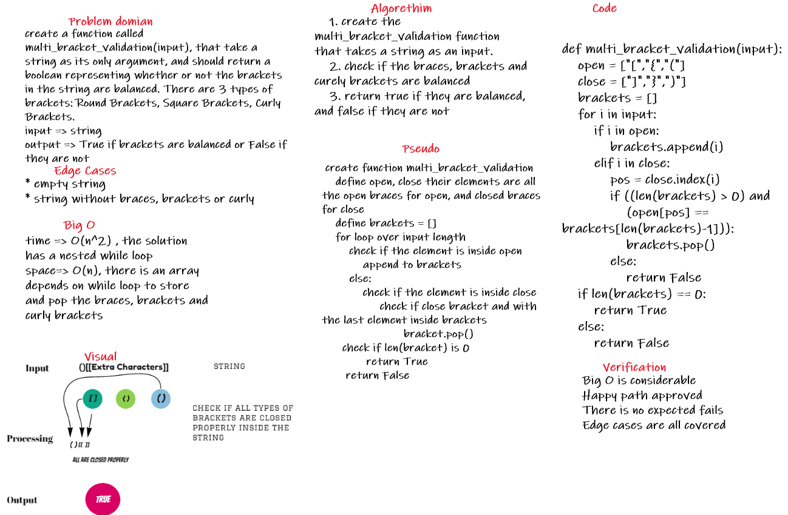

## code link

[code Link](multi_bracket_validation/multi_bracket_validation.py)

# Challenge Summary
Create a class called AnimalShelter which holds only dogs and cats. The shelter operates using a first-in, first-out approach. implement these methods:

* enqueue(animal): adds animal to the shelter. animal can be either a dog or a cat object.

* dequeue(pref): returns either a dog or a cat. If pref is not "dog" or "cat" then return null.

## Whiteboard Process


## Approach & Efficiency

i created the multi_bracket_validation function that takes in a string, the it starts checking if the character is an open bracket, open braces, open curly bracket, closed bracket, closed braces or a closed curly bracket or other characters then store them inside an empty array, if it's an open one, immediately store it, if it's a closing one, we check if the last element inside the array is the open one for that kind, if it's true, we remove them, if it's false, we keep the closing one, and the return will be False

## Solution

the method is well-explained inside the Approach and Efficiency part, this code passed all the tests provided in the code challenge, and it would give accurate results for all inputs situations.

```
def multi_bracket_validation(input):
    brackets = []
    for i in input:
        if i in open:
            brackets.append(i)
        elif i in close:
            pos = close.index(i)
            if ((len(brackets) > 0) and
                (open[pos] == brackets[len(brackets)-1])):
                brackets.pop()
            else:
                return False
    if len(brackets) == 0:
        return True
    else:
        return False
```