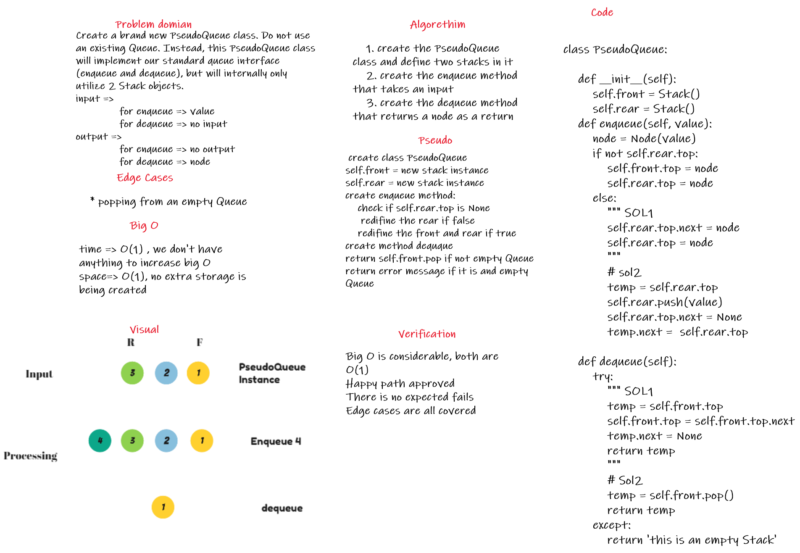

## code link

[code Link](queue_with_stacks/queue_with_stacks.py)

# Challenge Summary
Create a brand new PseudoQueue class. Do not use an existing Queue. Instead, this PseudoQueue class will implement our standard queue interface (the two methods listed below), but will internally only utilize 2 Stack objects. Ensure that you create your class with the following methods:

* enqueue(value) which inserts value into the PseudoQueue, using a first-in, first-out approach.

* dequeue() which extracts a value from the PseudoQueue, using a first-in, first-out approach.

## Whiteboard Process



## Approach & Efficiency
i started with creating a class called PseudoQueue, that takes two stacks as an input, to create a proper front and rear to the Queue. then i came up with two solutions for this code challenge, one with using push and pop methods from stack class, and one without it, i think that they both are efficient for such a situation.

## Solution

the first solution is the one with utilizing the push and pop methods, which is the one below
```
# for dequeue
    temp = self.front.pop()
    return temp
    
# for enqueue

        node = Node(value)
        if not self.rear.top:
            self.front.top = node
            self.rear.top = node
        else:
            temp = self.rear.top
            self.rear.push(value)
            self.rear.top.next = None
            temp.next =  self.rear.top
```

this solution is based on using the pop and push methods, for the second solution, i kind of mimicked the behavior of the Queue class and implement it inside the class methods, the second solution is below:

```
# for dequeue

    self.rear.top.next = node
    self.rear.top = node

# for enqueue

    temp = self.front.top
    self.front.top = self.front.top.next
    temp.next = None
    return temp
```

they are both the same when it comes to functionality.