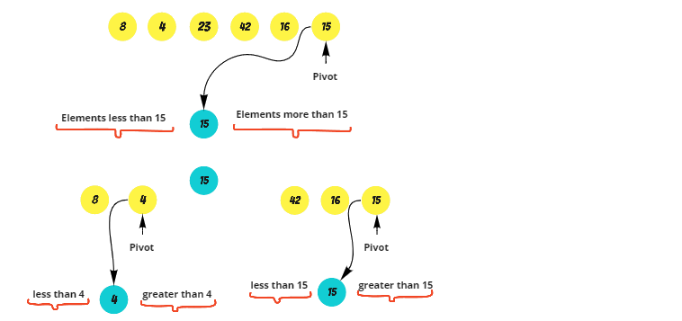
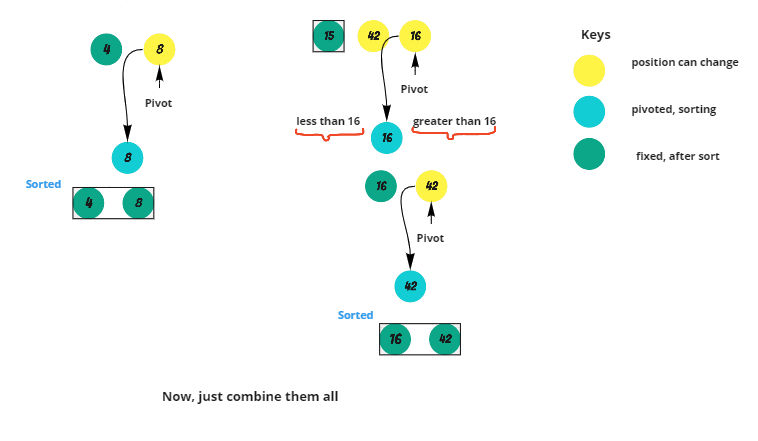

# Quicksort

QuickSort is a Divide and Conquer algorithm. It picks an element as pivot and partitions the given array around the picked pivot. There are many different versions of quickSort that pick pivot in different ways. 

1. Always pick first element as pivot.

2. Always pick last element as pivot (implemented below)

3. Pick a random element as pivot.

4. Pick median as pivot.

## Tracing

