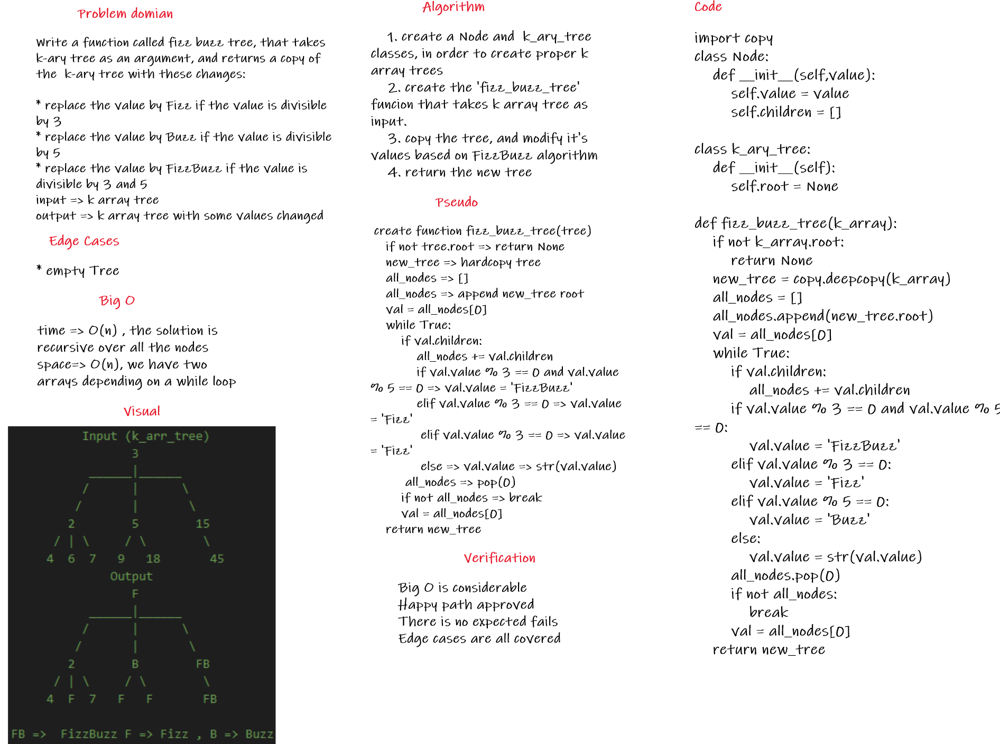

## Code

[code](tree_fizz_buzz/tree_fizz_buzz.py)

# Challenge Summary
Write a function called fizz buzz tree, that takes  k-ary tree as an argument, and returns a copy of the  k-ary tree with these changes:

* replace the value by Fizz if the value is divisible by 3
* replace the value by Buzz if the value is divisible by 5
* replace the value by FizzBuzz if the value is divisible by 3 and 5

## Whiteboard Process



## Approach & Efficiency

i took the approach of storing all the nodes inside an array, and loop over them, then change the values to Fizz, Buzz, or FizzBuzz, the Big O is as follows:

for the time complexity => O(n), we have a while loop that loops over all the nodes in the solution

for the space complexity  => O(n), we have a list that is directly dependent on a while loop to store the values

## Solution

the solution is as follows:

first, i created a Node and k_ary_tree classes that should handle creating new k_array trees, then, i created the fizz_buzz_tree class that takes a k_array tree as an input, and return a new one that replaces the value by Fizz if the value is divisible by 3, Buzz if the value is divisible by 5, and FizzBuzz if the value is divisible by 3 and 5, the following is the code

```
import copy
class Node:
    def __init__(self,value):
        self.value = value
        self.children = []

class k_ary_tree:
    def __init__(self):
        self.root = None

def fizz_buzz_tree(k_array):
    if not k_array.root:
        return None
    new_tree = copy.deepcopy(k_array)
    all_nodes = []
    all_nodes.append(new_tree.root)
    val = all_nodes[0]
    while True:
        if val.children:
            all_nodes += val.children
        if val.value % 3 == 0 and val.value % 5 == 0:
            val.value = 'FizzBuzz'
        elif val.value % 3 == 0:
            val.value = 'Fizz'
        elif val.value % 5 == 0:
            val.value = 'Buzz'
        else:
            val.value = str(val.value)
        all_nodes.pop(0)
        if not all_nodes:
            break
        val = all_nodes[0]
    return new_tree
```