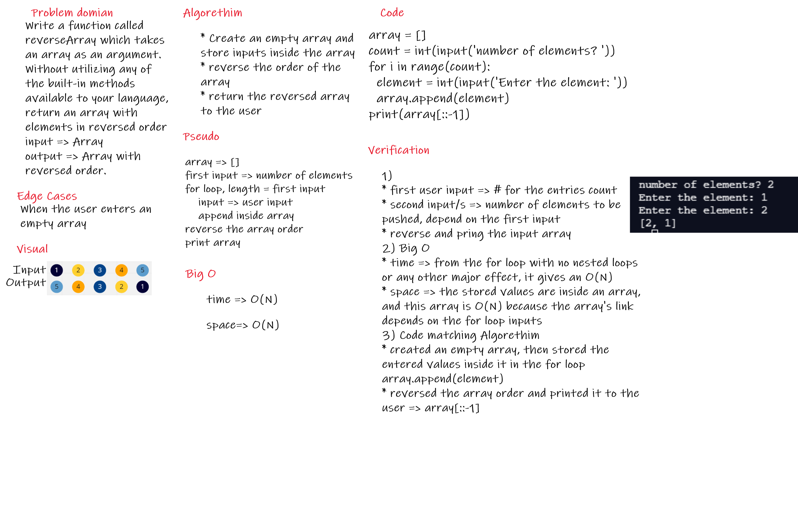
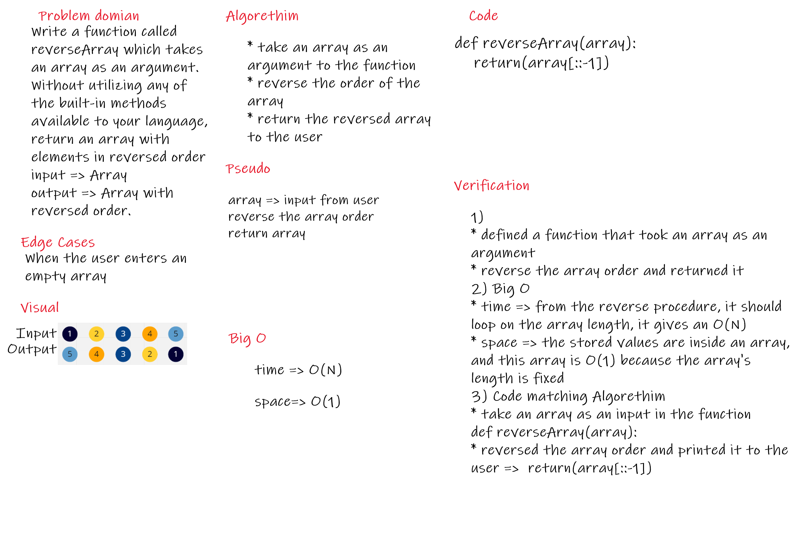

# Reverse an Array
Write a function called reverseArray which takes an array as an argument. Without utilizing any of the built-in methods available to your language, return an array with elements in reversed order

## Whiteboard Process
### first idea      

### second idea (lab requirement)

## Approach & Efficiency
<!-- What approach did you take? Discuss Why. What is the Big O space/time for this approach? -->
i took a longer approach, coz i didn't think that there is an array input as a user, and i was right.

for the first approach, i made a first input, to indicate the number of arguments to be entered inside the array, then a set of inputs to be pushed to the empty array, when the array is full, i reversed the array order and printed the result

Big O:

* time => from the for loop with no nested loops or any other major effect, it gives an O(N)

* space => the stored values are inside an array, and this array is O(N) because the array's lingth depends on the for loop inputs

for the second approach(lab requierment), i made a simple function that takes an array as an input, reverse it's order then return the reversed array

Big O:

* time => from the reverse procedure it should loop over the array length, it gives an O(N)

* space => the stored values are inside an array, and this array is O(1) because the array's lingth is fixed, and does not depend on any looping