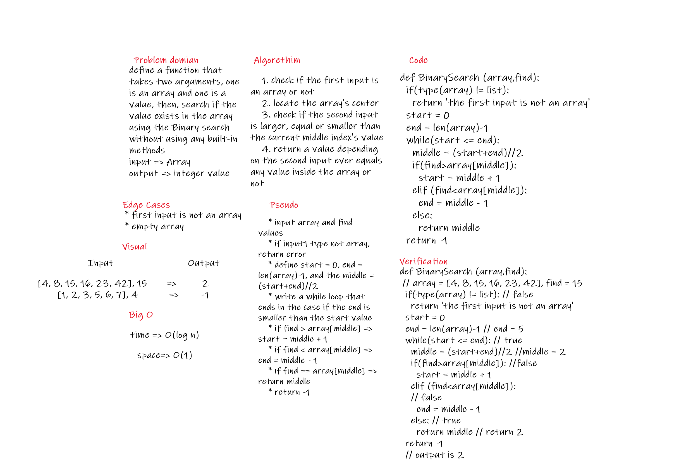

# Find an item inside an array
Write a function called BinarySearch which takes in 2 parameters: a sorted array and the search key. Without utilizing any of the built-in methods available to your language, return the index of the array’s element that is equal to the value of the search key, or -1 if the element is not in the array.

## Whiteboard Process



1. Problem Domain:

> define a function that takes two arguments, one is an array and one is a value, then, search if the value exists in the array using the Binary search without using any built-in methods

*****************************
2. In/Out

**In** => Array of n elements and a Value

**Out** => either the index of the found value, or -1 if the input value is not in the array
*****************************
3. Edge cases:

* first input is not an array
* empty array
*****************************
4. Visulization

**In** => ```[4, 8, 15, 16, 23, 42], 15```

**Out** => ```2```

**In** => ```[-131, -82, 0, 27, 42, 68, 179], 42```

**Out** => ```4```

**In** => ```[11, 22, 33, 44, 55, 66, 77], 90```

**Out** => ```-1```

**In** => ```[1, 2, 3, 5, 6, 7], 4```

**Out** => ```-1```

*****************************

5. Big-O

time Complexity => O(log n)

space Complexity => O(1)

*****************************

6. Algortihm:

    1. check if the first input is an array or not
    2. locate the array's center
    3. check if the second input is larger, equal or smaller than the current middle index's value
    4. return a value depending on the second input ever equals any value inside the array or not

*****************************

7. Pseudo Code
    * input array and find values
    * if input1 type not array, return error
    * define start = 0, end = len(array)-1, and the middle = (start+end)//2
    * write a while loop that ends in the case if the end is smaller than the start value
    * if find > array[middle] => start = middle + 1
    * if find < array[middle] => end = middle - 1
    * if find == array[middle] => return middle
    * return -1

*****************************

8. Code
```python
def BinarySearch (array,find):
  if(type(array) != list):
    return 'the first input is not an array'
  start = 0
  end = len(array)-1
  while(start <= end):
    middle = (start+end)//2
    if(find>array[middle]):
      start = middle + 1
    elif (find<array[middle]):
      end = middle - 1
    else:
      return middle
  return -1
```

*****************************

9. Verification: 

In: input1 = [4, 8, 15, 16, 23, 42], 15
expected Out: 2

def BinarySearch (array,find):
 // array = [4, 8, 15, 16, 23, 42], find = 15
  if(type(array) != list): // false
    return 'the first input is not an array'
  start = 0
  end = len(array)-1 // end = 5
  while(start <= end): // true
    middle = (start+end)//2 //middle = 2
    if(find>array[middle]): //false
      start = middle + 1
    elif (find<array[middle]):
    // false
      end = middle - 1
    else: // true
      return middle // return 2
  return -1  
  // output is 2

  ## Approach & Efficiency
  
  for the approach, i created a function that takes two inputs, one is an array, and the other is any value, then returned the index if the value equals one of the array's values, or -1 if it didn't

Big O:

* time => from the while loop, we are looping using a logarithmic method, it gives an O(log n)

* space => the stored values are inside an array, and this array is O(1) because the array's length increased be a known amount, that is 1, and does not depend on any looping